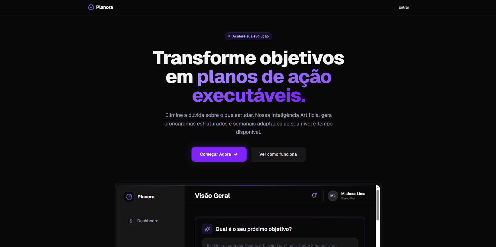
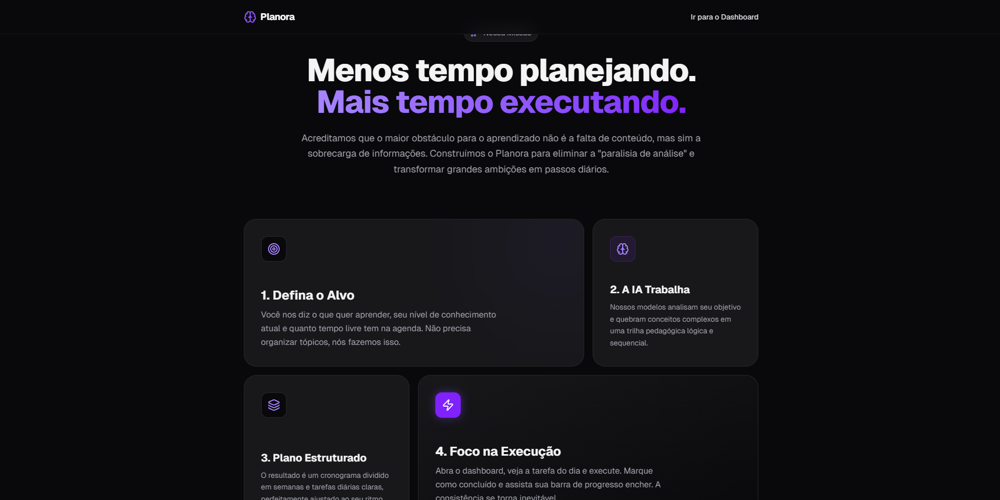
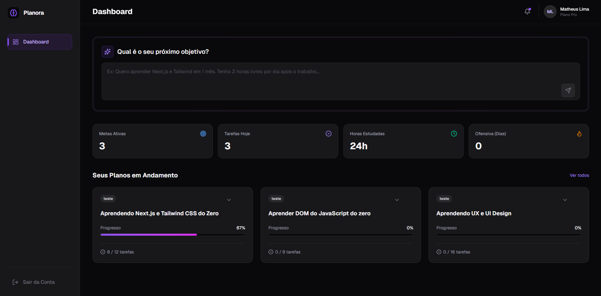
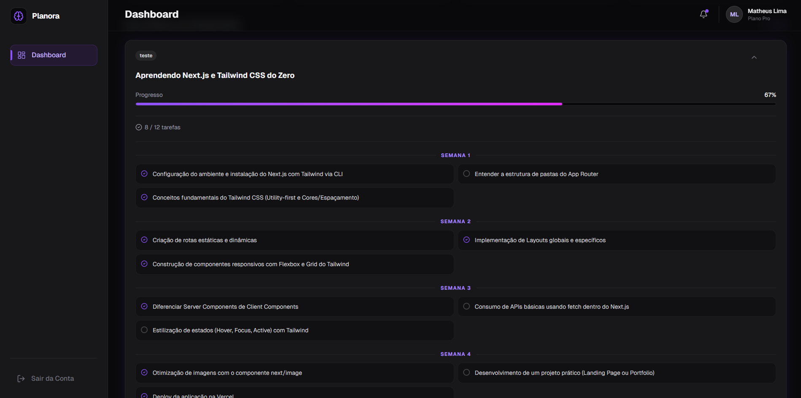
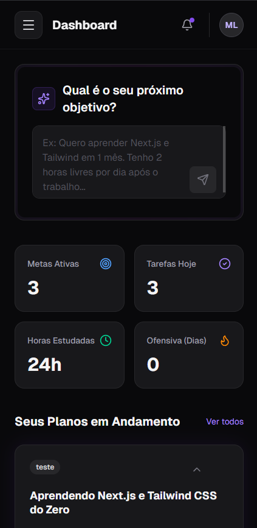
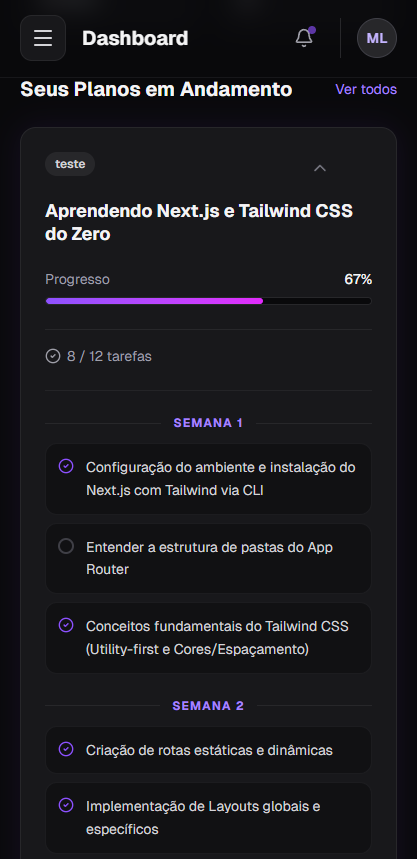
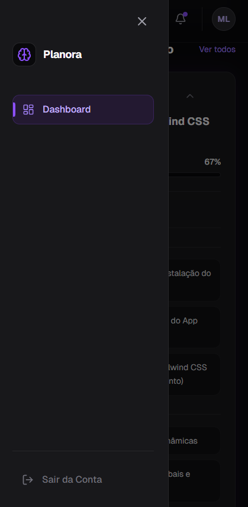

# Planora: Estudos com IA

## Índice

- [O Problema](#problema)
- [A Solução](#a-solução)
- [Demonstração](#demonstração)
- [Encerramento](#encerramento)
- [Deploy](#deploy)
- [Repositório](#repositório)
- [Tecnologias utilizadas](#tecnologias-utilizadas)
- [Em breve](#em-breve)
- [Como executar o projeto](#como-executar-o-projeto)
- [Prints](#prints)


## O Problema {#problema}

Aprender algo novo nunca foi tão acessível — mas, ao mesmo tempo, nunca foi tão confuso.

Cursos, vídeos, artigos… informação demais e direção de menos.

Muitas pessoas começam motivadas, mas desistem no meio do caminho por não saberem exatamente o que estudar, quando estudar e como evoluir.

 

 

 

## A Solução {#a-solução}

O Planora resolve isso.

É uma plataforma de autodesenvolvimento que utiliza inteligência artificial para transformar um objetivo em um plano claro, estruturado e executável.

Você diz o que quer aprender, seu nível e quanto tempo tem disponível — e o Planora gera automaticamente um cronograma com tarefas semanais personalizadas.

Sem sobrecarga. Sem dúvida. Apenas execução.

 

## Demonstração {#demonstração}

O uso é simples:

Você acessa o dashboard, descreve seu objetivo em um campo de texto — por exemplo: “Quero aprender React em 2 meses” — e a IA gera um plano de estudos completo.

Esse plano já vem organizado em semanas, com tarefas prontas para serem executadas.

E ao longo do tempo, você pode acompanhar seu progresso, manter consistência e evoluir de forma clara.

 

## Encerramento {#encerramento}

O Planora não é apenas sobre estudar mais.

É sobre estudar com direção.

Transformar intenção em ação — e ação em resultado.

 

## Deploy {#deploy}

Com persistência de dados e função de criar plano

#### https://planora-puce.vercel.app/

-> Clicar em "começar agora" na landing page ou entrar direto no link do dashboard:

## Repositório {#repositório}

#### https://github.com/Mattferreira1/Planora

## Tecnologias utilizadas {#tecnologias-utilizadas}

- Next.js
- React
- TypeScript
- Tailwind CSS
- Google Gemini AI
- Framer Motion
- Lucide React
- Zod

## Em breve {#em-breve}
- Prisma 
- PostgreSQL

## Como executar o projeto {#como-executar-o-projeto}

1. Clone o repositório:

   ```bash
   git clone https://github.com/Mattferreira1/Planora.git
   cd planora
   ```

2. Instale as dependências:

   ```bash
   npm install
   ```

3. Configure as variáveis de ambiente:

   Crie um arquivo `.env` na raiz do projeto e adicione as variáveis necessárias, como `DATABASE_URL` para o banco de dados PostgreSQL e `DIRECT_URL` conforme definido no `prisma.config.ts`.

   ```json
    DATABASE_URL="YOUR_DATABASE_URL"

    DIRECT_URL="YOUR_DATABASE_DIRECT_URL"

    GOOGLE_API_KEY="YOUR_GOOGLE_APIkEY"
   ```

4. Execute as migrações do banco de dados (opicional):

   ```bash
   npx prisma migrate dev
   ```

5. Inicie o servidor de desenvolvimento:

   ```bash
   npm run dev
   ```

   O projeto estará disponível em `http://localhost:3000`.


## Prints {#prints}

### Landing Page
  
*Captura da página de entrada com chamada para ação.*

  
*Exemplo de como o plano é gerado pela IA.*

### Versão Desktop
  
*Interface completa do dashboard para criação de planos.*

  
*Tela de acompanhamento de metas e tarefas.*

### Versão Mobile
  
*Versão responsiva do Dashboard.*

  
*Interface otimizada para dispositivos móveis.*

  
*Menu responsivo.*
